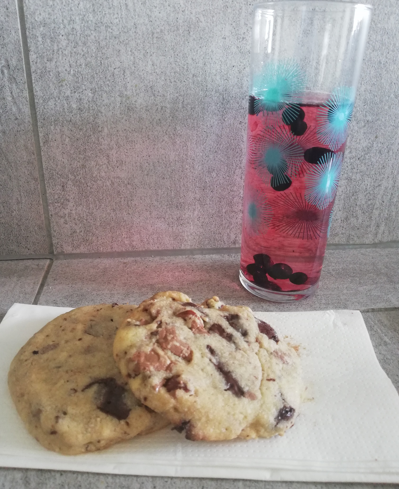

# The Chef's cookies
<h3 align="center"><i> A cookie recipe taken from Jean-François Piège, a french chef!</i></h3>

Preparation: 45mins Bake time: 10-15mins
Author: nouille#2370

## Ingredients
* 370g flour
* 215g half-salt butter
* 1 egg
* Vanilla powder
* 1/2 packet of baking powder
* 215g brown sugar
* 170g white sugar
* 200g chocolate (pick your favorite type)
* 40g hazelnuts

## Materials
* A Pastry robot (or your hands)
* An oven
* A big bowl

## Method
1. Cut the butter in slices and put it in the bowl with the sugar. Mix.  
_Tip_ : If you don't have half-salt butter, put regular butter instead and add 1 teaspoon of coarse salt.
2. Add vanilla powder (I usually put 1 teaspoon but it's up to you to decide how much you want to put in) and the egg. Mix again.
3. Add the flour and mix.
4. Turn on your oven and put the thermostat at 160° (if your oven is old, you might need to put it at 180°).
5. Put your dough aside and cut your chocolate in pieces.
6. Cut your hazelnuts in half and add them with the chocolate in the dough. Mix everything together.
7. With a tablespoon, make a ball of dough. It should be the size of a ping pong ball (but you can change the size if you want).
8. Put it on your oven plate and with the palm of your hand, flatten the ball. No need to flatten it too much, the dough will spread in the oven. Therefore, be careful and put some space between every dough bit.
9. Place your plate once you're done placing the dough. Let it bake for 10mins.  
_Tip_ : If your cookies seem to be raw after 10mins, let them bake 2 or 3 more minutes. It's better to not let them cook too much so they can be soft on the inside and crunchy on the outside ;D

 Enjoy! 

## Conclusion
Cookies are pretty long to make but you can be creative and "personnalize" them as much as you want. They're also very nice to eat after school (or work) or during a hike...You can enjoy them everywhere!

## Discussion
I personnaly don't put baking powder in my cookie dough because I don't like the taste it gives to my cookies, try with and without it and see what's the best for your taste buds! ;)  

I also don't like adding that much sugar so I remove the white sugar. Again, see for yourself if you like your cookies very sweet or medium like me :)  

Then, when it comes to the chocolate, I like to do 50% milk chocolate and 50% dark chocolate. It balances well between the sweeteness of the milk chocolate and the bitterness of the dark one.  

Finally, if you don't have hazelnuts (or you just do not enjoy them) you can replace them with 100g of sesame seeds.
