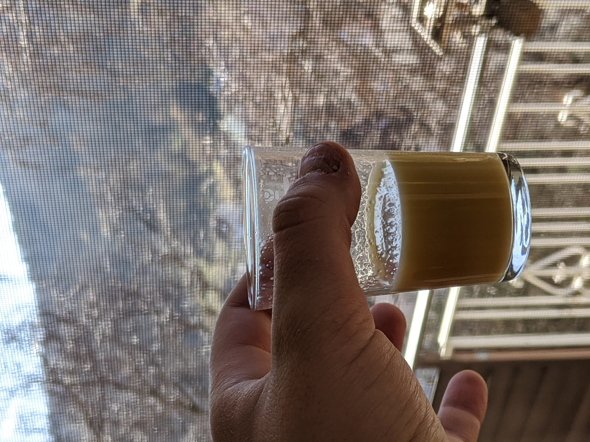

# Ginger Shots

    

Preparation: ~15min

Author:  

## Ingredients
- 150g Ginger Roots
- 150g Honey
- 2 Apples
- 1-2 Lemons
- 1-3 Limes (optional)
- Apple Juice (amount depends)

## Materials
- Blender
- Knife

## Method

1. Wash the ginger roots and the apples
2. Cut off the "woody" ends of the ginger
3. Remove the core of the Apple
4. Slice both the ginger and the apple into small pieces   
**(The pieces will be blended with their peel on)**
5. Put the pieces together into the blender
6. Juice the lemons and the limes
7. Pour the lemon & lime juice over the pieces
8. Blend until the mixture is smooth
9. Put the honey into the blender and pray that most of your kitchen stays clean
10. Blend until smooth again
11. Pour the mixture into a container through a sieve
12. Use a spoon the press out all the juice of the mix
13. When the mix in the sieve is getting a little more firm put it back to the rest of the puree and mix again
14. Repeat step 11-13 until all of your puree is drier and more firm and the mix in your other container is more liquid and doesn't have as much pieces in there.

## Conclusion
This is a ***very*** spicy drink which should be enjoyed preferably in a shot glass at the start of a day.   
It will give you a very good health boost, so it is pretty good to have in the cold winter months.
## Discussion
I rather dislike pieces in my ginger shots so i sieve the mix i get at the end into the another container again so it is even more smooth and liquid.