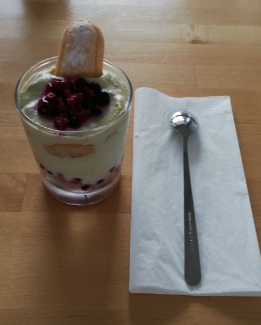

# Matcha Tiramisu

Preparation: 1h

## Ingredients
* 1kg mascarpone
* 8 egg yolks and 8 egg whites
* 6 tablespoons of sugar
* 60 finger biscuits
* Matcha powder (japanese green tea)
* Rose water 
* Berries or strawberries
## Materials
* Electronic whisk 
* Glass containers (it can be simple glasses)
* Spatula
* 2 big bowls
* 1 regular bowl
## Method
1. Take the big bowls. Separate the whites from the yolks. Be careful, even a small piece of yolk in the white could mess up the recipe! 
2. Leave the whites on the side for now. Add the sugar in the yolks. Beat the yolks until it turns white and double in volume.
3. Add the mascarpone and mix until it's homogenous.
4. Beat the egg whites until it triples in volume. Don't beat them up for too long! Once it is foamy, you have to stop.
5. Add half of the egg whites to the mascarpone mix.
6. Mix gently. Be careful not to break the egg whites, use a spatula!
7. Add the other half and mix again.
8. Once it's homogenous, add 2 teaspoons of matcha powder. Taste the cream and see if you like it. You can add a few more if you find it not strong enough. But be aware that matcha powder has a strong taste and is very bitter!
9. First, fill the regular bowl with rose water (you don't have to feel it entirely but just enough for dipping).
10. Dip a finger biscuit in and put it in the bottom of your container. Repeat until you covered the bottom entirely.
11. Pour some cream in the glass. One or two tablespoons should be enough.
12. Put one or two teaspoons of berries (or strawberries).
13. Repeat steps 9 and 10.
14. Add some berries (or strawberries) on top for decoration.
Done!
## Conclusion
Matcha Tiramisu is a recipe that needs some basic cooking knowledge but stays easy to make once you've understood the technique.
## Descussion
The original tiramisu recipe has 6 eggs. I changed it because the cream had a weird texture, it was too thick and didn't feel good in your mouth. By putting 2 more eggs, the cream gains in texture and becomes more light and more pleasant. 
