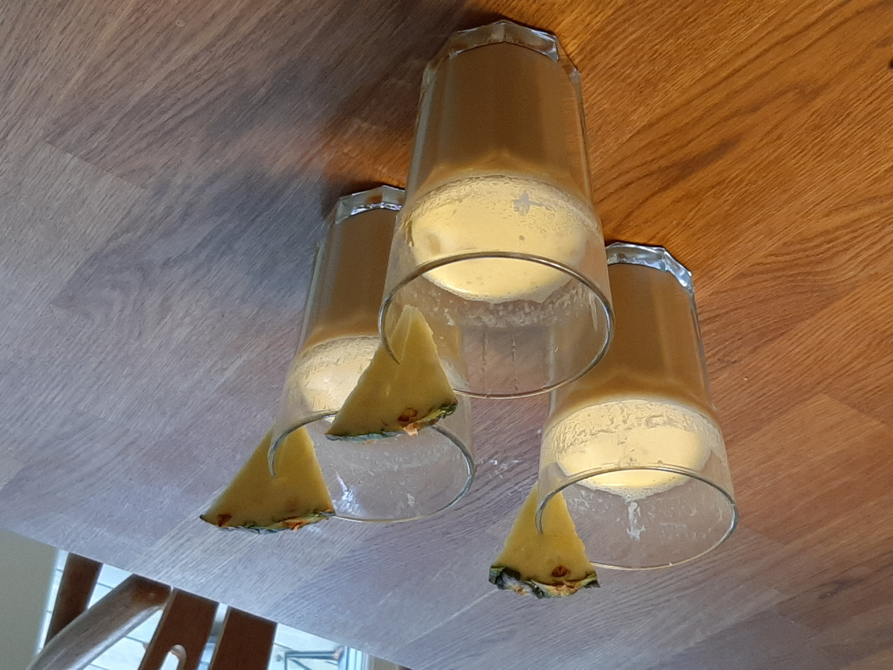

# Piña Colada (Alcohol Free)

Preparation: ~5min per Glass   
Author:  

## Ingredients
- 30ml Coconut syrup/cream/milk (either one)
- 120ml Pineapple Juice
- 1 Piece of Pineapple as garnish (optional)
- 30ml Whipped cream (whipped/non-whipped)
- 100g Ice cubes

## Materials
- Powerful mixer with ice-crushing option (optional)

## Method
1. Put ice cubes in the mixxer and make crushed ice (optional)
2. Put ice cubes/crushed-ice into mixxer glass (or into a normal glass and skip step 5)
3. Pour coconut syrup/cream/milk into glass
4. Pour pineapple juice into glass
5. Mix until creamy (either with mixer glass or stir it)
6. Pour into drinking glass and decorate it with pineapple pieces

## Conclusion
A fairly easy drink to make and it's very nice on a summer day for those who like the combination of dairy and pineapple

## Discussion
I myself don't have a mixxer glass, so i just put crushed ice or ice cubes into a normal glass, pour the ingredients over and mix with a straw.
