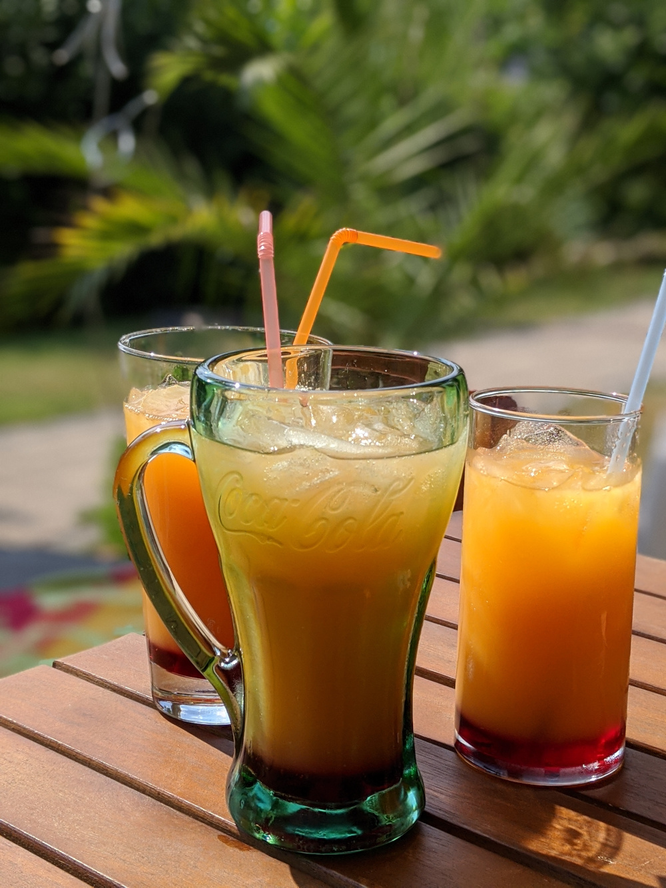

# Virgin Sunrise (Alcohol Free)

    

Preparation: ~5min per Glass  
Author:  

## Ingredients
- 90ml Orange Juice
- 15ml Grenadine Syrup
- 1-2 Limes
- 1 Slice of Orange (optional)
- Ice (cubed/crushed)
## Method
1. Crush the ice using a technique of your choice (optional)
2. Put the ice cubes or crushed ice into a glass
3. Pour the Grenadine Syrup into the glass
4. Slice the Limes into quarters and squeeze the juice into the glass
5. Pour the Orange Juice over into the glass so that the ingredients get mixed
6. Decorate with the orange slice (optional)
## Conclusion
This drink is very quick to make and tastes very good.
## Discussion
Depending on how sour you like your drink you can vary how much lime juice you want, or just dont use any.  
 
You can also just ignore the quantities and put a little bit of syrup at the bottom like shown in the picture and just fill the rest with orange juice.
