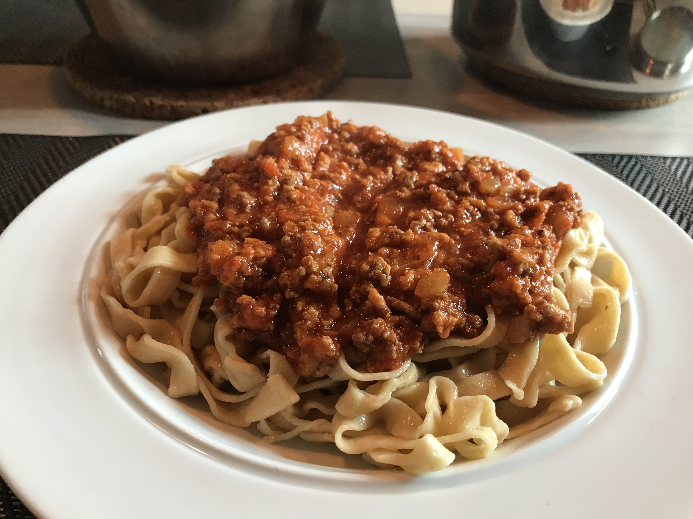

# Pasta Meatsauce 

Preparation: Dried pasta: 30 minutes
Author:  
  

## Ingredients  
- 800 grams of chopped tomatoes (canned)  
- 70 grams of tomatoe purea  
- 800 grams of ground meat  
- 1 onion
- 2 small carrots (or one large)
- A pinch of basil (optionally)
- A bit of chili (optionally)

I expect you to have: olive oil, salt, pepper and pasta

## Materials  
- Two pots  
- A chopping board and knfie
- A stick blender

## Method  
1. Start out by minceing the onion, you want slices of about 1-2 mm  
2. Heat up the first pot with a bit of olive oil  
3. Once the oil has gotten hot add the onion and let them cook untill slightly translucent, they shouldnt start to brown so if you see that reaction occur turn the heat down a bit  
4. Add the meat, you decide if you want it chunky or in small pellets, i like it the second way so at this step i grind the meat using the spachula  
5. While the meat is browning coin the carrots into small slices, beware for step 6 and keep sturing the meat so they dont burn  
6. Once the meat has browned you want to take if off and pour it into a bowl, i like to put some suran rap over it to keep the juces in  
7. You might see in the bottom of the pan some onion and browning is still stuck, this is not a problem. We add a bit more oil together with the carrots  
8. Once the carrots have gotten a bit of the heat we add the canned tomatoes, add the chopped once first and stir, this will release all the browning on the bottom of the bot  
9. Add the tomatoe purrae, salt, pepper, basil etc to taste. You might also want to add the chili here  
10. Let the tomatoe mixture simmer for a few minutes untill it has combined  
11. Using a stick blender give the sauce some love, i like a few chunks in my sauce but how much you blend is up to you, its your sauce afterall  
12. Add the meats back into the sauce and let it simmer at a medium-low heat under a lid  
13. Using the other pot, fill it halfway with water and set it to boil  
14. Once the water is boiling add a good amount of salt, it should be like the ocian and then add the pasta  
15. Let the pasta cook untill it's good, i like my pasta to have a bit of chew, do not overcook the pasta so keep an eye on it  

And youre done!

## Conclusion  
Quit a good dish, i recommend doing a good salad to accomedate it.

## Discussion
Ways to improve the dish would be doing homemade fresh pasta, it honestly adds to the experiance.
